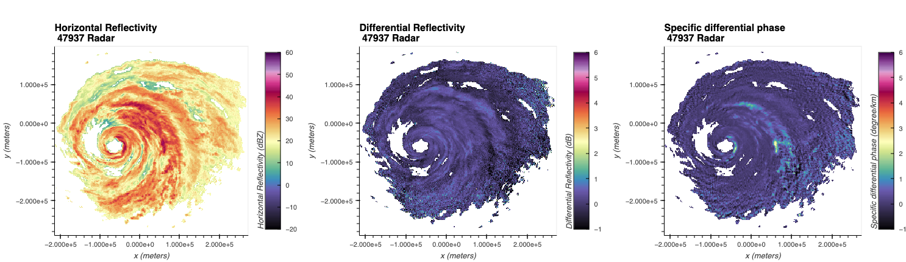

---
jupytext:
  text_representation:
    extension: .md
    format_name: myst
    format_version: 0.13
    jupytext_version: 1.16.4
kernelspec:
  display_name: Python 3 (ipykernel)
  language: python
  name: python3
---

</img>
# Interactive JMA Radar Visualization

+++

## Overview
Within this cookbook, we will detail how to create interactive plots of radar data!

1. Reading data with Xradar
1. Creating your first interactive figure with Xradar + hvPlot
1. Combining your plots into a single dashboard
1. Filtering and Checking Data Quality
1. Create a Dashboard to Analyze ZDR Bias

+++

## Imports

```{code-cell} ipython3
import xarray as xr
import xradar as xd
import glob
import pyart
import hvplot.xarray
import holoviews as hv
from open_radar_data import DATASETS
import panel as pn

hv.extension("bokeh")
```

## Prerequisites

It is recommended that you are familiar with working with weather radar data, the core data structures, and the basics of reading in different radar datasets.

| Concepts | Importance | Notes |
| --- | --- | --- |
| [Intro to Cartopy](https://foundations.projectpythia.org/core/cartopy/cartopy.html) | Necessary | |
| [Xradar User Guide: Plot a PPI](https://docs.openradarscience.org/projects/xradar/en/stable/notebooks/plot-ppi.html) | Necessary | |
| [Understanding of NetCDF](https://foundations.projectpythia.org/core/data-formats/netcdf-cf.html) | Helpful | Familiarity with metadata structure |

- **Time to learn**: 30 minutes

+++

## Reading Data with Xradar

While we have focused much of the content around the Python ARM Radar Toolkit (Py-ART), [Xradar](https://docs.openradarscience.org/projects/xradar/en/stable) is another helpful package we can use to work with this in xarray!

Here, we use data from the Japanese weather radar, using sample data [from here](https://github.com/openradar/asean2024-pyrad-course/tree/main/data/JMA).

+++

Sample data will be saved locally, and then the variables of reflectivity and differential reflectivity are used in this notebook.

```{code-cell} ipython3
reflectivity_file = DATASETS.fetch("Z__C_RJTD_20230801200000_RDR_JMAGPV_RS47937_Gar0p250km0p35deg_PRref_N11_ANAL_cfrad.nc")
zdr_file = DATASETS.fetch("Z__C_RJTD_20230801200000_RDR_JMAGPV_RS47937_Gar0p250km0p35deg_PRzdr_N11_ANAL_cfrad.nc")
kdp_file = DATASETS.fetch("Z__C_RJTD_20230801200000_RDR_JMAGPV_RS47937_Gar0p250km0p35deg_PRkdp_N11_ANAL_cfrad.nc")
```

### Read the data in xradar
We use [xradar](https://docs.openradarscience.org/projects/xradar/en/stable/), an open-source toolkit to read weather radar data and load into the Xarray data structure. The data format here is a CF/Radial1 file, so we use the [`open_cfradial1_datatree`](https://docs.openradarscience.org/projects/xradar/en/stable/notebooks/CfRadial1.html) reader.

```{code-cell} ipython3
radar = xd.io.open_cfradial1_datatree(reflectivity_file).xradar.georeference()
radar
```

```{code-cell} ipython3
radar_zdr = xd.io.open_cfradial1_datatree(zdr_file).xradar.georeference()
radar_zdr
```

```{code-cell} ipython3
radar_kdp = xd.io.open_cfradial1_datatree(kdp_file).xradar.georeference()
radar_kdp
```

## Creating Your First Interactive Figure with Xradar and hvPlot
hvPlot is helpful tool when working with interactive visualizions! It is a tool built on top of several other packages, that we can use with Xarray.

By default, this visualization plots azimuth along the y-axis and range along the y-axis. While this is desired in certain cases, we cannot gather much spatial information from this.

```{code-cell} ipython3
ref = radar["sweep_0"].DBZH.hvplot.quadmesh(cmap='pyart_ChaseSpectral',
                                            title='Horizontal Reflectivity (dBZ)',
                                            clim=(-20,60))
ref
```

### Refining Our Plot - Recreating a Plan Position Indicator (PPI)
We instead would like to create a Plan Position Indicator (PPI) plot. Since we already georeferenced the dataset, we set x/y to be `x` and `y`, or the distance away from the radar, as well as tuning some additional parameters. We set `rasterize=True` to lazily load in the data, which renders the plot more quickly and increases resolution as we zoom in.

```{code-cell} ipython3
ref = radar["sweep_0"].DBZH.hvplot.quadmesh(x='x',
                                            y='y',
                                            cmap='pyart_ChaseSpectral',
                                            clabel='Horizontal Reflectivity (dBZ)',
                                            title=f'Horizontal Reflectivity \n JMA {radar.attrs["site_name"]} Radar',
                                            clim=(-20, 60),
                                            height=400,
                                            rasterize=True,
                                            width=500,)
```

```{code-cell} ipython3
zdr = radar_zdr["sweep_0"].ZDR.hvplot.quadmesh(x='x',
                                               y='y',
                                               cmap='pyart_ChaseSpectral',
                                               clabel='Differential Reflectivity (dB)',
                                               title=f'Differential Reflectivity \n JMA {radar.attrs["site_name"]} Radar',
                                               clim=(-1, 6),
                                               height=400,
                                               rasterize=True,
                                               width=500,)
```

```{code-cell} ipython3
kdp = radar_kdp["sweep_0"].KDP.hvplot.quadmesh(x='x',
                                               y='y',
                                               cmap='pyart_ChaseSpectral',
                                               clabel='Specific differential phase (degree/km)',
                                               title=f'Specific differential phase \n JMA {radar.attrs["site_name"]} Radar',
                                               clim=(-1, 6),
                                               height=400,
                                               rasterize=True,
                                               width=500,)
```

### Combining your plots into a single dashboard
You can combine plots using the `+` syntax to add plots side-by-side, or `*` to add them to the same plot. For example, let's combine our reflectivity and velocity plot.

```{code-cell} ipython3
(ref + zdr + kdp).cols(1)
```

## Filtering and Checking Data Quality
We can also filter our data - notice the low values in both differential reflectivity and reflectivity. We can mask these out using `Xarray`!

```{code-cell} ipython3
# Subset our first sweep
ds0 = radar["sweep_0"].to_dataset()
ds1 = radar_zdr["sweep_0"].to_dataset()
```

```{code-cell} ipython3
ds = xr.merge([ds0, ds1])
ds
```

### Determine Mask Thresholds
Let's determine our thresholds for filtering the data, using histograms! These are available through `hvPlot`, using the `.hvplot.hist()` extension.

```{code-cell} ipython3
zdr_hist = ds.ZDR.hvplot.hist()
ref_hist = ds.DBZH.hvplot.hist()
(zdr_hist + ref_hist).cols(1)
```

Notice how we have very low values for both fields, which we can threshold using:
- Differential Reflectivity < -5
- Horizontal Reflectivity < -32

```{code-cell} ipython3
ds = ds.where((ds.ZDR >= -5) & (ds.DBZH != -32))
ds
```

### Double Check our Filtered Data
Let's double check that our filtering worked - notice the new, more representative distributions!

```{code-cell} ipython3
zdr_hist = ds.ZDR.hvplot.hist()
ref_hist = ds.DBZH.hvplot.hist()
(zdr_hist + ref_hist).cols(1)
```

## Create a Dashboard to Analyze ZDR Bias
A common data quality check is differential reflectivity bias. This value should be around 0 for low values of horizontal reflectivity. We use a few steps here to create this visualization
- Unstack the dataset so we are left with a single dimension - the single range gate (single points)
- Create histograms (`.hist`) and a 2-dimensional histogram (`.hexbin`) to visualize the data
- Stack these into single view using `gridspec`

```{code-cell} ipython3
ds = ds.stack({"gate": {"azimuth", "range"}}).reset_index("gate")

hist_dbz = ds.hvplot.hist("DBZH",
                          width=500,
                          height=200,
                          title="Horizontal Reflectivity Distribution",)
hist_zdr = ds.hvplot.hist("ZDR",
                          height=400,
                          title="Differential Reflectivity Distribution",
                         ).opts(invert_axes=True)
hexbin = ds.hvplot.hexbin(x='DBZH',
                          y='ZDR',
                          title='Reflectivity vs. Differential Reflectivity Distribution',
                          width=500,
                          height=400) *  hv.HLine(0,
                                                  label='Differential Reflectivity = 0 Line').opts(color='red',
                                                           line_width=1)

gspec = pn.GridSpec(width=800, height=400)

gspec[0,   0:2  ] = hist_dbz
gspec[1:3,   0:2  ] = hexbin
gspec[1:3,   2  ] = hist_zdr

gspec
```

## Summary
Within this notebook, we covered how to use interactive visualizations with your weather radar data, including applications to checking data quality.

### What's Next?
Next, we will continue to explore methods of cleaning and visualizing data!

+++

## Resources and References
- [Xradar documentation](https://docs.openradarscience.org/projects/xradar/en/stable/index.html)
- [IDEAM radar data](https://registry.opendata.aws/ideam-radares/)

```{code-cell} ipython3

```
